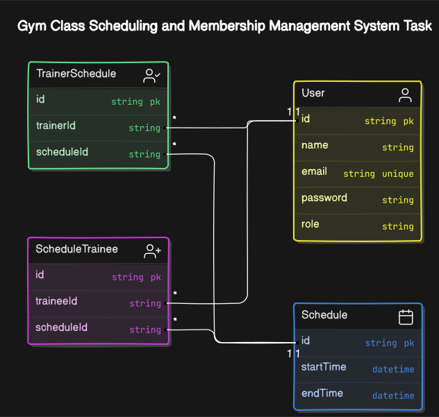

# GymSync 🎉

## Project Overview 🌍

This project is a gym class scheduling and management system where trainees can join available classes, trainers can view their schedules, and admins can manage schedules, trainers, and trainees. The system enforces business rules such as a maximum of 5 classes per day, 10 trainees per class, and specific roles for users, such as Admin, Trainer, and Trainee.

## Relation Diagram 🗺️



## Technology Stack 🔧

- **TypeScript**: A strongly-typed language that builds on JavaScript.
- **Express.js**: Web application framework for Node.js, used for building APIs.
- **Prisma**: Database toolkit used for querying and managing the database.
- **PostgreSQL**: Relational database used for storing data.
- **JWT**: JSON Web Tokens for secure authentication.

## API Endpoints 🚀

### POST `/auth/register`

- **Description**: Create a new trainee account.
- **Body**:

  - `name`: Trainee full name.
  - `email`: Trainee email.
  - `password`: Trainee Password.
  - **Response**:

  ```json
  {
    "success": true,
    "message": "User created successfully!"
  }
  ```

### POST `/auth/login`

- **Description**: Login to the account.
- **Body**:
  - `email`: Email to login.
  - `password`: Password to login.
  - **Response**:
  ```json
  {
    "success": true,
    "message": "Login successful"
  }
  ```

### POST `/trainer`

- **Description**: Create trainer (Admin only)
- **Body**:

  - `name`: Trainer full name.
  - `email`: Trainer email.
  - `password`: Trainer Password.
  - **Response**:

  ```json
  {
    "success": true,
    "message": "User created successfully!"
  }
  ```

### DEL `/trainer`

- **Description**: Delete trainer (Admin only)
- **Body**:

  - `Headers -> Authorization`: Trainer full name.
  - `Params -> id`: Trainer id.
  - **Response**:

  ```json
  {
    "success": false,
    "message": "Invalid or expired token. Please log in again."
  }
  ```

### PUT `/trainer`

- **Description**: Update trainer (Admin only)
- **Body**:

  - `Headers -> Authorization`: Trainer full name.
  - `Params -> id`: Trainer id.
  - `Form -> name`.
  - `Form -> email`.
  - `Form -> password`.
  - **Response**:

  ```json
  {
    "success": false,
    "message": "Trainer not found"
  }
  ```

### POST `/schedules` 🗓️

- **Description**: Create a new class schedule (Admin only).
- **Body**:
  - `startTime`: The start time of the class.
- **Response**:
  ```json
  {
    "success": true,
    "message": "Schedule created successfully."
  }
  ```

### POST `/schedules/assign-trainer` 👨‍🏫

- **Description**: Assign a trainer to a specific schedule (Admin only).
- **Body**:
  - `scheduleId`: The ID of the schedule.
  - `trainerId`: The ID of the trainer.
- **Response**:
  ```json
  {
    "success": true,
    "message": "Trainer assigned to the schedule."
  }
  ```

### POST `/schedules/join` 🤝

- **Description**: Trainee joins a class schedule.
- **Body**:
  - `scheduleId`: The ID of the schedule.
  - `traineeId`: The ID of the trainee.
- **Response**:
  ```json
  {
    "success": true,
    "message": "Trainee joined the schedule successfully."
  }
  ```

### GET `/schedules/:trainerId` 📅

- **Description**: Get the list of schedules for a specific trainer.
- **Response**:
  ```json
  [
    {
      "scheduleId": 1,
      "trainerId": 101,
      "trainerName": "John Doe",
      "date": "2024-12-01",
      "time": "10:00 AM"
    },
    ...
  ]
  ```

## Database Schema 🗂️

Here is an overview of the main models in the system:

### `User` Model 👤

```ts
model User {
  id       String @id @default(cuid())
  name     String @db.VarChar(50)
  email    String @unique @db.VarChar(64)
  password String @db.VarChar(100)
  role     ROLE   @default(TRAINEE)

  TrainerSchedule TrainerSchedule[]
  ScheduleTrainee ScheduleTrainee[]
}
```

### `Schedule` Model 📆

```ts
model Schedule {
  id        String   @id @default(uuid()) @db.Uuid
  startTime DateTime
  endTime   DateTime

  trainees        ScheduleTrainee[]
  TrainerSchedule TrainerSchedule[]
}

```

### `TrainerSchedule` Model

```ts
model TrainerSchedule {
  id String @id @default(uuid()) @db.Uuid

  trainerId  String
  trainer    User     @relation(fields: [trainerId], references: [id])
  scheduleId String   @db.Uuid
  schedule   Schedule @relation(fields: [scheduleId], references: [id])
}
```

### `ScheduleTrainee` Model

```ts
model ScheduleTrainee {
  id         String   @id @default(uuid()) @db.Uuid
  scheduleId String   @db.Uuid
  schedule   Schedule @relation(fields: [scheduleId], references: [id])
  traineeId  String
  trainee    User     @relation(fields: [traineeId], references: [id])
}
```

## Admin Credentials 🔑

To log in as an admin, use the following credentials:

- **Email**: admin@gymsync.com
- **Password**: 123456

## Instructions to Run Locally 🏃‍♂️

1. **Clone the repository**:

   ```bash
   git clone https://github.com/mjahidhasand4/gymsync.git
   cd gymsync/backend
   ```

2. **Install dependencies**:

   ```bash
   bun install
   ```

3. **Run the database migrations**:

   ```bash
   bunx prisma migrate dev
   ```

4. **Start the server**:

   ```bash
   bun dev
   ```

6. The application will be running on `http://localhost:3001`.

## Live Hosting Link 🌐

[Test in Postman](https://documenter.getpostman.com/view/35390614/2sAYBYgWGr)